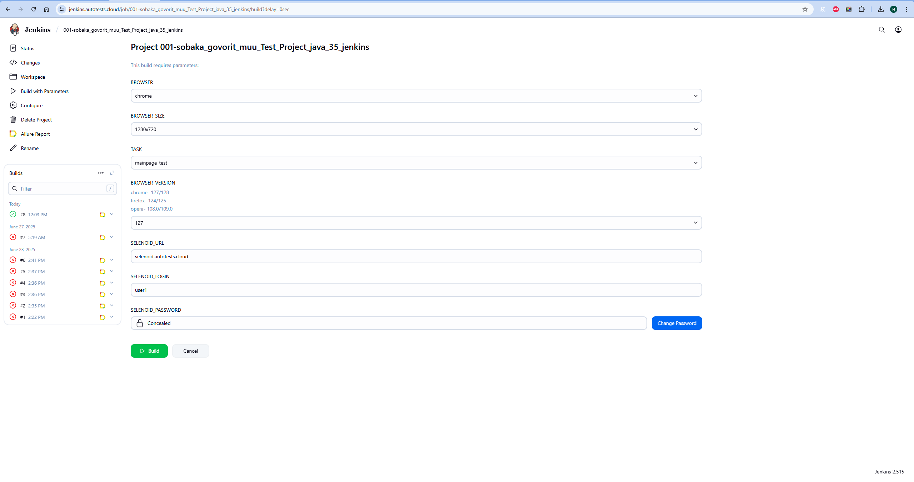
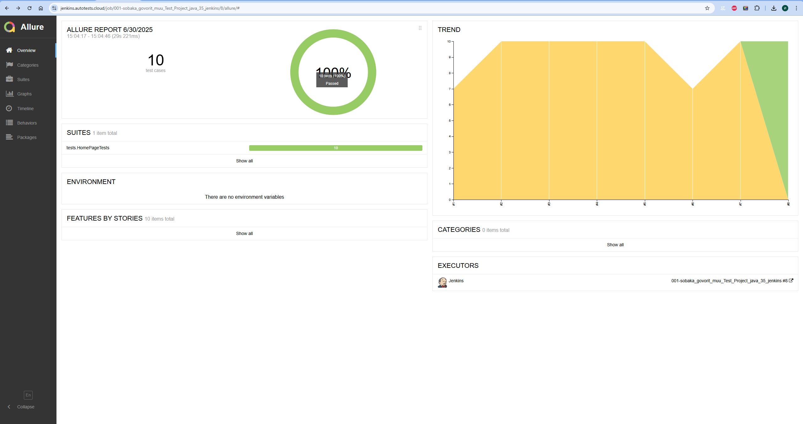
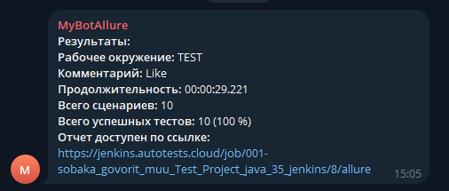

# Test_Project

<a href="https://pro-vzglyad.ru/ ">  
<h2 >Test_Project по автоматизации тестирования для компании <a href="https://pro-vzglyad.ru/ "> PRO Взгляд</a></h2> 

## ☑️ Содержание:

- Технологии и инструменты
- Список проверок, реализованных в тестах
- Запуск тестов (сборка в Jenkins) и из терминала
- Allure-отчет
- Уведомление в Telegram о результатах прогона тестов
- Видео пример прохождения тестов

<a id="tools"></a>

## ☑️ Технологии и инструменты:

| Java                                                                                                           | IntelliJ  <br>  Idea                                                                                                              | GitHub                                                                                                                 | JUnit 5                                                                                                     | Gradle                                                                                                           | Selenide                                                                                                   | Selenoid                                                                                                            | Java <br> Faker                                                                                                    | Allure <br> Report                                                                                                   | Jenkins                                                                                                    | Telegram                                                                                                      |
|:---------------------------------------------------------------------------------------------------------------|-----------------------------------------------------------------------------------------------------------------------------------|------------------------------------------------------------------------------------------------------------------------|-------------------------------------------------------------------------------------------------------------|------------------------------------------------------------------------------------------------------------------|------------------------------------------------------------------------------------------------------------|---------------------------------------------------------------------------------------------------------------------|--------------------------------------------------------------------------------------------------------------------|----------------------------------------------------------------------------------------------------------------------|------------------------------------------------------------------------------------------------------------|---------------------------------------------------------------------------------------------------------------|
| <a href="https://www.java.com/"></a> | <a href="https://www.jetbrains.com/idea/"></a> | <a href="https://github.com/"></a> | <a href="https://junit.org/junit5/"></a> | <a href="https://gradle.org/"></a> | <a href="https://selenide.org/"></a> | <a href="https://aerokube.com/selenoid/"></a> | <a href="https://dius.github.io/java-faker/"></a> | <a href="https://github.com/allure-framework"></a> | <a href="https://www.jenkins.io/"></a> | <a href="https://web.telegram.org/"></a> |

<a id="cases"></a>

## ☑️ Реализованные проверки:

- Проверка меню навигации
- Проверка контактной информации
- Проверка корректности переходов в разделы обучения
- Проверка корректной работы фильтра в разделе обучения
- Проверка заполнения обязательных полей формы обратной связи

##  Сборка в [Jenkins](https://jenkins.autotests.cloud/job/001-sobaka_govorit_muu_Test_Project_java_35_jenkins/build?delay=0sec)

<p align="center">  
</a>  
</p>

## ☑️ Параметры сборки в Jenkins:

- browser (браузер, по умолчанию chrome)
- browserVersion (версия браузера, по умолчанию 127.0)
- browserSize (размер окна браузера, по умолчанию 1920x1080)
- selenoidCredentials (логин и пароль)
- selenoidUrl (адрес Selenoid)

## Команда для запуска из терминала

Локальный запуск

```bash
gradle clean ${TASK}
```

Запуск с параметрами:

```bash  
-Dbrowser=chrome "-Dversion=127" "-Dresolution=1920x1080" "-DselenoidCredentials=*****:****@" "-DselenoidUrl=-selenoid.autotests.cloud"
```

Удаленный запуск через Jenkins:

```bash  
clean ${TASK} 
-Dselenoid.url=${SELENOID_URL} 
-Dselenoid.login=${SELENOID_LOGIN} 
-Dselenoid.password=${SELENOID_PASSWORD} 
-Dbrowser=${BROWSER} 
-Dbrowser.version=${BROWSER_VERSION} 
-Dbrowser.size=${BROWSER_SIZE}
```

## </a>  <a name="Allure"></a>Allure [Report](https://jenkins.autotests.cloud/job/001-sobaka_govorit_muu_Test_Project_java_35_jenkins/8/allure/#suites/7f9d8baf248447e4d019dfa37c0ac4ba/b72c556894322309/)    </a>

## Основная страница отчёта

<p align="center">  
  
</p>  

____

## </a> Уведомление в Telegram при помощи бота

____
<p align="center">  
  
</p>

____

## </a> Примеры видео выполнения тестов на Selenoid

____
<p align="center">
   
</p>